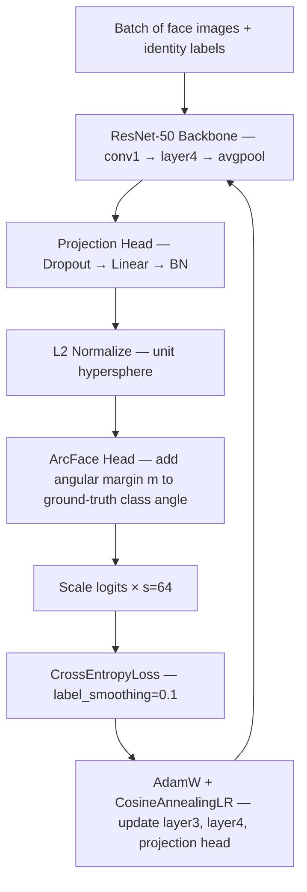
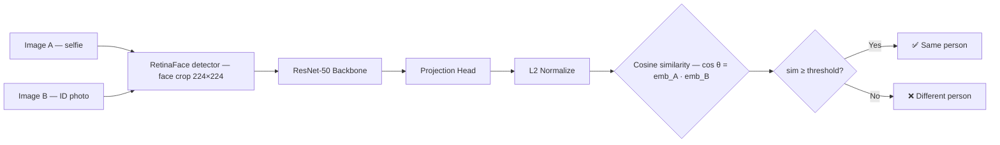
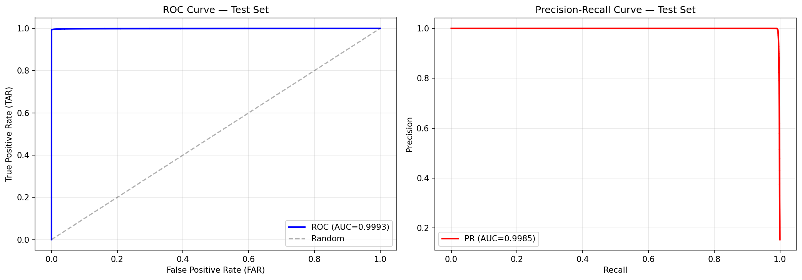

# Model Card — JaviFace v1 (`javi_face_v1.onnx`)

> Face verification model based on ResNet-50 + ArcFace, trained from scratch on a large-scale face identity dataset.

---

## Overview

| Field             | Value                                           |
| ----------------- | ----------------------------------------------- |
| **Task**          | Face verification (1:1 identity matching)       |
| **Architecture**  | ResNet-50 backbone + ArcFace head               |
| **Embedding dim** | 512                                             |
| **Input size**    | 224 × 224 RGB                                   |
| **Output**        | L2-normalized embedding on the unit hypersphere |
| **Similarity**    | Cosine similarity                               |
| **Export format** | ONNX (runtime: CUDA / CoreML / CPU)             |
| **License**       | MIT                                             |

---

## Intended Use

- **Primary use:** 1:1 face verification in KYC / onboarding flows (selfie vs ID document).
- **Secondary use:** Selfie-to-selfie liveness verification, ID document deduplication.
- **Out-of-scope:** Face identification (1:N search), age/gender estimation, surveillance.

---

## Training Data

| Split     | Images      | Identities |
| --------- | ----------- | ---------- |
| Train     | 688 976     | 75 408     |
| Val       | 86 222      | 9 426      |
| Test      | 86 399      | 9 427      |
| **Total** | **861 597** | **94 261** |

**Split ratios:** 80 % train / 10 % val / 10 % test — identities are disjoint across splits (no identity leakage).

### Data Structure

Each identity folder must contain **at least 4 selfie images** and **at least 4 ID document photos** (filenames ending in `_dni.png`):

```
DATA_ROOT/
├── persona_001/
│   ├── img1.jpg          ← selfie
│   ├── img2.jpg          ← selfie
│   ├── img3.jpg          ← selfie
│   ├── img4.jpg          ← selfie
│   ├── img1_dni.png      ← ID document photo
│   ├── img2_dni.png
│   ├── img3_dni.png
│   └── img4_dni.png
├── persona_002/
│   └── ...
```

> The `_dni.png` suffix is the convention that flags a crop as an ID document image during dataset construction and evaluation.

---

## Architecture

### Backbone — ResNet-50 (partially frozen)

| Layer block           | Trainable     |
| --------------------- | ------------- |
| conv1 / bn1 / maxpool | Frozen        |
| layer1                | Frozen        |
| layer2                | Frozen        |
| layer3                | **Unfrozen**  |
| layer4                | **Unfrozen**  |
| avgpool               | Frozen        |
| Projection head       | **Trainable** |

**Projection head:**

```
Dropout(p=0.15) → Linear(2048, 512) → BatchNorm1d(512) → L2-normalize
```

The final L2 normalization projects every embedding onto the 512-dimensional unit hypersphere, making cosine similarity equivalent to a dot product.

### Head — ArcFace (Additive Angular Margin Loss)

ArcFace adds a fixed angular margin **m = 0.5 rad (~28.6°)** to the angle between the embedding and its ground-truth class weight vector. This forces the model to learn embeddings that are angularly tight within each identity and maximally separated between identities — a much stricter geometric constraint than a plain softmax.

Key hyperparameters:

| Parameter | Value | Description                        |
| --------- | ----- | ---------------------------------- |
| `s`       | 64.0  | Scale factor (inverse temperature) |
| `m`       | 0.5   | Angular margin (radians)           |

---

## Training Configuration

| Hyperparameter      | Value                                    |
| ------------------- | ---------------------------------------- |
| Epochs              | 50                                       |
| Batch size          | 128                                      |
| Base LR             | 3 × 10⁻⁴                                 |
| Optimizer           | AdamW (weight decay = 5 × 10⁻⁴)          |
| Scheduler           | CosineAnnealingLR (η_min = 10⁻⁶)         |
| Loss                | CrossEntropyLoss (label smoothing = 0.1) |
| Pretrained backbone | ImageNet (ResNet-50 default weights)     |

---

## Training & Inference Flow

### Training



### Inference



---

## Recommended Thresholds

Thresholds are calibrated on the test set to balance FAR and FRR for each scenario:

| Scenario              | Threshold | Operating point |
| --------------------- | --------- | --------------- |
| Selfie vs Selfie      | `0.2632`  | EER ≈ 0.485 %   |
| Selfie vs ID document | `0.1869`  | EER ≈ 1.862 %   |
| ID document vs ID     | `0.1990`  | EER ≈ 2.228 %   |

> **Lower threshold = stricter match.** ID document photos have different illumination, compression artifacts, and perspective compared to selfies, so a lower similarity is expected even for genuine pairs — the threshold is adjusted accordingly.

---

## Evaluation — Test Set

### Selfie vs Selfie




| Metric             | Value   |
| ------------------ | ------- |
| ROC-AUC            | 0.9993  |
| PR-AUC             | 0.9985  |
| EER                | 0.485 % |
| Precision          | 99.54 % |
| Recall             | 99.33 % |
| FAR                | 0.084 % |
| FRR                | 0.670 % |
| TAR @ FAR = 10⁻³   | 99.34 % |
| TAR @ FAR = 10⁻⁴   | 99.11 % |
| Decision threshold | 0.2632  |
| Positive pairs     | 90 952  |
| Negative pairs     | 500 000 |

### Selfie vs ID Document (Cross-Modal)

| Metric             | Value   |
| ------------------ | ------- |
| ROC-AUC            | 0.9951  |
| PR-AUC             | 0.9920  |
| EER                | 1.862 % |
| Precision          | 97.31 % |
| Recall             | 97.47 % |
| FAR                | 0.665 % |
| FRR                | 2.532 % |
| TAR @ FAR = 10⁻³   | 95.59 % |
| TAR @ FAR = 10⁻⁴   | 91.03 % |
| Decision threshold | 0.1869  |
| Positive pairs     | 123 600 |
| Negative pairs     | 500 000 |

### ID Document vs ID Document

| Metric             | Value   |
| ------------------ | ------- |
| ROC-AUC            | 0.9930  |
| PR-AUC             | 0.9878  |
| EER                | 2.228 % |
| Precision          | 97.60 % |
| Recall             | 97.08 % |
| FAR                | 0.421 % |
| FRR                | 2.917 % |
| TAR @ FAR = 10⁻³   | 96.39 % |
| TAR @ FAR = 10⁻⁴   | 94.90 % |
| Decision threshold | 0.1990  |
| Positive pairs     | 88 003  |
| Negative pairs     | 500 000 |

---

## Authors

**Javier Daza** · [javierjdaza@gmail.com](mailto:javierjdaza@gmail.com) · [GitHub](https://github.com/javierjdaza/javiface/tree/main)
