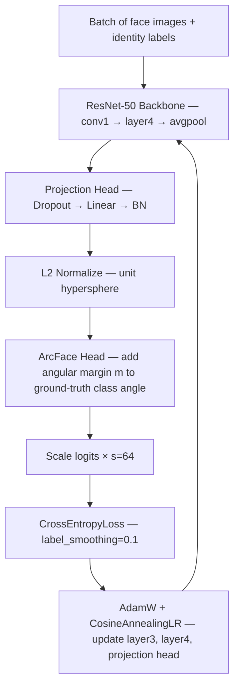
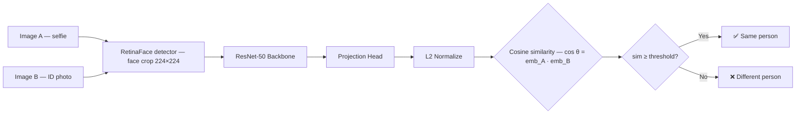
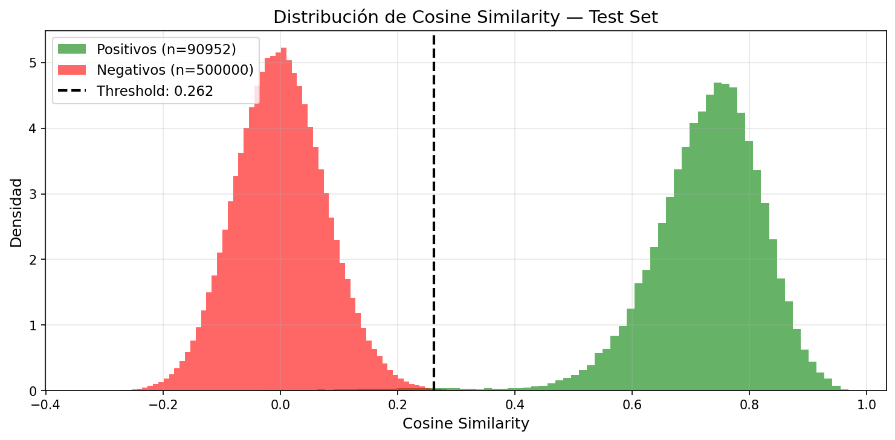
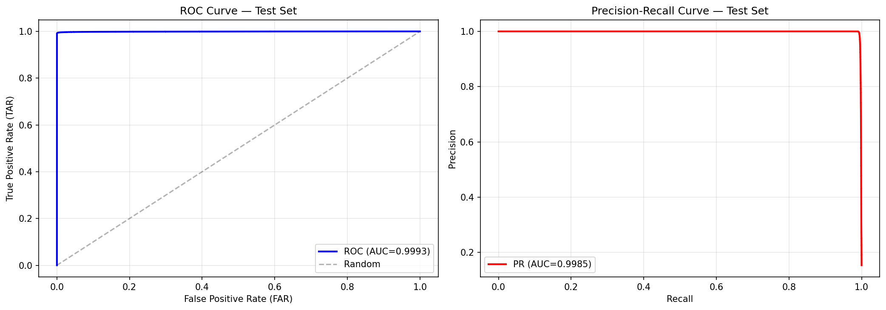

# Model Card — JaviFace v1 (`javi_face_v1.onnx`)

> Face verification model based on ResNet-50 + ArcFace, trained from scratch on a large-scale face identity dataset.

---

## Overview

| Field             | Value                                           |
| ----------------- | ----------------------------------------------- |
| **Task**          | Face verification (1:1 identity matching)       |
| **Architecture**  | ResNet-50 backbone + ArcFace head               |
| **Embedding dim** | 512                                             |
| **Input size**    | 224 × 224 RGB                                   |
| **Output**        | L2-normalized embedding on the unit hypersphere |
| **Similarity**    | Cosine similarity                               |
| **Export format** | ONNX (runtime: CUDA / CoreML / CPU)             |
| **License**       | MIT                                             |

---

## Intended Use

- **Primary use:** 1:1 face verification — selfie vs selfie identity matching.
- **Secondary use:** Liveness checks, duplicate account detection across selfie images.
- **Out-of-scope:** Face identification (1:N search), selfie vs ID document cross-modal matching, age/gender estimation, surveillance.

---

## Training Data

| Split     | Identities      | Images          | Imgs/ID (avg) |
| --------- | --------------- | --------------- | ------------- |
| Train     | 186 127         | 819 590         | 4.4           |
| Val       | 23 266          | 102 377         | 4.4           |
| Test      | 23 266          | 103 236         | 4.4           |
| **Total** | **232 659**     | **1 025 203**   | —             |

**Split ratios:** ~80 % train / ~10 % val / ~10 % test — identities are disjoint across splits (no identity leakage).

### Evaluation Pairs

| Split | Total pairs   | Genuine pairs | Impostor pairs |
| ----- | ------------- | ------------- | -------------- |
| Val   | 1 150 000     | 150 000       | 1 000 000      |
| Test  | 1 150 000     | 150 000       | 1 000 000      |

### Data Structure

Each identity folder contains selfie images only:

```
DATA_ROOT/
├── persona_001/
│   ├── img1.jpg
│   ├── img2.jpg
│   ├── img3.jpg
│   └── img4.jpg
├── persona_002/
│   └── ...
```

---

## Architecture

### Backbone — ResNet-50 (partially frozen)

| Layer block           | Trainable     |
| --------------------- | ------------- |
| conv1 / bn1 / maxpool | Frozen        |
| layer1                | Frozen        |
| layer2                | Frozen        |
| layer3                | **Unfrozen**  |
| layer4                | **Unfrozen**  |
| avgpool               | Frozen        |
| Projection head       | **Trainable** |

**Projection head:**

```
Dropout(p=0.15) → Linear(2048, 512) → BatchNorm1d(512) → L2-normalize
```

The final L2 normalization projects every embedding onto the 512-dimensional unit hypersphere, making cosine similarity equivalent to a dot product.

### Head — ArcFace (Additive Angular Margin Loss)

ArcFace adds a fixed angular margin **m = 0.5 rad (~28.6°)** to the angle between the embedding and its ground-truth class weight vector. This forces the model to learn embeddings that are angularly tight within each identity and maximally separated between identities — a much stricter geometric constraint than a plain softmax.

Key hyperparameters:

| Parameter | Value | Description                        |
| --------- | ----- | ---------------------------------- |
| `s`       | 64.0  | Scale factor (inverse temperature) |
| `m`       | 0.5   | Angular margin (radians)           |

---

## Training Configuration

| Hyperparameter      | Value                                    |
| ------------------- | ---------------------------------------- |
| Epochs              | 50                                       |
| Batch size          | 128                                      |
| Base LR             | 3 × 10⁻⁴                                 |
| Optimizer           | AdamW (weight decay = 5 × 10⁻⁴)          |
| Scheduler           | CosineAnnealingLR (η_min = 10⁻⁶)         |
| Loss                | CrossEntropyLoss (label smoothing = 0.1) |
| Pretrained backbone | ImageNet (ResNet-50 default weights)     |
| Train classes       | 186 127                                  |
| Total parameters    | 119 855 168                              |
| Trainable params    | 118 410 240 (98.8 %)                     |

---

## Training & Inference Flow

### Training


```mermaid
flowchart TD
    A["Batch of face images + identity labels"] --> B["ResNet-50 Backbone — conv1 → layer4 → avgpool"]
    B --> C["Projection Head — Dropout → Linear → BN"]
    C --> D["L2 Normalize — unit hypersphere"]
    D --> E["ArcFace Head — add angular margin m to ground-truth class angle"]
    E --> F["Scale logits × s=64"]
    F --> G["CrossEntropyLoss — label_smoothing=0.1"]
    G --> H["AdamW + CosineAnnealingLR — update layer3, layer4, projection head"]
    H --> B
```

### Inference


```mermaid
flowchart LR
    A1["Image A — selfie"] --> B["RetinaFace detector — face crop 224×224"]
    A2["Image B — ID photo"] --> B
    B --> C["ResNet-50 Backbone"]
    C --> D["Projection Head"]
    D --> E["L2 Normalize"]
    E --> F{"Cosine similarity — cos θ = emb_A · emb_B"}
    F --> G{"sim ≥ threshold?"}
    G -- Yes --> H["✅ Same person"]
    G -- No  --> I["❌ Different person"]
```

---

## Recommended Thresholds — Selfie vs Selfie

Thresholds are calibrated on the test set. A similarity **≥ threshold** is classified as same person.

| Operating point        | Threshold   | TAR     | Use when                                    |
| ---------------------- | ----------- | ------- | ------------------------------------------- |
| Youden (balanced)      | `0.2166`    | —       | General use, balanced FAR/FRR               |
| FAR ≤ 10⁻³ (0.1 %)    | `0.2136`    | 99.30 % | Moderate security (consumer apps)           |
| FAR ≤ 10⁻⁴ (0.01 %)   | `0.2629`    | 99.09 % | Standard KYC / onboarding                  |
| FAR ≤ 10⁻⁵ (0.001 %)  | `0.3095`    | 98.95 % | High-security verification                  |
| FAR ≤ 10⁻⁶ (0.0001 %) | `0.3242`    | 98.91 % | Critical applications (banking, government) |

> **Higher threshold → stricter match → lower FAR.** Each step up roughly reduces false accepts by 10× while TAR drops by only ~0.1–0.2 pp — the model trades a tiny fraction of genuine accepts to achieve very strong impostor rejection.

---

## Evaluation — Test Set

### Selfie vs Selfie




| Metric              | Value           |
| ------------------- | --------------- |
| ROC-AUC             | 0.9987          |
| PR-AUC              | 0.9975          |
| EER                 | 0.53 %          |
| Precision           | 99.41 %         |
| Recall              | 99.29 %         |
| FAR                 | 0.09 %          |
| FRR                 | 0.71 %          |
| TAR @ FAR = 10⁻³    | 99.30 %         |
| TAR @ FAR = 10⁻⁴    | 99.09 %         |
| TAR @ FAR = 10⁻⁵    | 98.95 %         |
| TAR @ FAR = 10⁻⁶    | 98.91 %         |
| Decision threshold  | 0.2166 (Youden) |
| Genuine pairs       | 150 000         |
| Impostor pairs      | 1 000 000       |

---

## Authors

**Javier Daza** · [javierjdaza@gmail.com](mailto:javierjdaza@gmail.com) · [GitHub](https://github.com/javierjdaza/javiface/tree/main)
