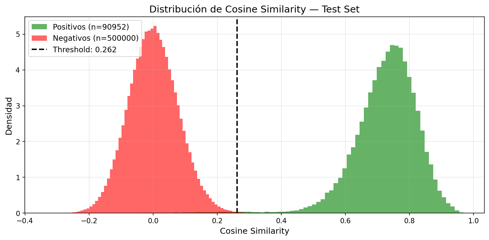

# JaviFace 🎯

**Accurate face comparison — selfie vs selfie, selfie vs ID, ID vs ID.**

[](https://pypi.org/project/javiface/)
[](https://www.python.org/)
[](https://opensource.org/licenses/MIT)

---

## What is JaviFace?

JaviFace is a lightweight Python library for **face verification**. Given two face images, it tells you whether they belong to the same person — with scenario-specific thresholds calibrated for selfie and ID document comparisons.

Under the hood it runs two models:

| Component                  | Format        | Role                                  |
| -------------------------- | ------------- | ------------------------------------- |
| **RetinaFace** (ResNet-50) | TensorFlow H5 | Face detection, alignment & crop      |
| **FaceVerifier**           | ONNX          | 512-dim embedding + cosine similarity |

**FaceVerifier** runs on **CUDA**, **CoreML**, or **CPU** — automatically selected based on your hardware.

---

## Install

```bash
pip install javiface
```

or

```bash
poetry add javiface
```

**Required:** `tensorflow` for RetinaFace detection. On TF ≥ 2.16 also install:

```bash
pip install tf-keras
```

**GPU acceleration (NVIDIA CUDA):** replace the default `onnxruntime` with `onnxruntime-gpu`:

```bash
pip uninstall onnxruntime
pip install "onnxruntime-gpu>=1.22.0"
```

---

## Quick Start

```python
from PIL import Image
from javiface import JaviFace, RetinaFace as rf

# Load models
model = rf.build_model("retinaface.h5")
verifier = JaviFace("javi_face_v1.onnx")

# Load images
img1 = Image.open("selfie.jpg")
img2 = Image.open("id_photo.jpg")

# Crop & align faces (PIL in → PIL out)
face1 = rf.get_face(img1, model)
face2 = rf.get_face(img2, model)

# Compare
# threshold = 0.2621 -> Selfie vs Selfie [default]
# threshold = 0.1838 -> Selfie vs ID document
# threshold = 0.1990 -> ID document vs ID document
result = verifier.compare(face1, face2, threshold=0.2621)

print(result)
# {'similarity': 0.214, 'same_person': False}
```

---

## Model Metadata

| Parameter         | Value                 |
| ----------------- | --------------------- |
| Embedding dim     | 512                   |
| Input size        | 224 × 224             |
| Similarity metric | Cosine                |
| Normalize mean    | [0.485, 0.456, 0.406] |
| Normalize std     | [0.229, 0.224, 0.225] |

---

## Model Cards

### `retinaface.h5` — Face Detector

| Field            | Value                             |
| ---------------- | --------------------------------- |
| **Architecture** | ResNet-50 + FPN + SSH heads       |
| **Framework**    | TensorFlow / Keras                |
| **Output**       | Bounding boxes + 5 face landmarks |
| **Primary use**  | Face detection, alignment & crop  |

### `javi_face_v1.onnx` — Face Verifier

> ResNet-50 backbone + ArcFace head, trained from scratch on ~860 K face images across 94 K identities.

| Field             | Value                                    |
| ----------------- | ---------------------------------------- |
| **Architecture**  | ResNet-50 + ArcFace (m=0.5, s=64)        |
| **Embedding dim** | 512 — L2-normalized (unit hypersphere)   |
| **Training data** | 861 597 images · 94 261 identities       |
| **Export format** | ONNX (CUDA / CoreML / CPU)               |
| **Primary use**   | KYC — selfie vs ID document verification |

### Performance

| Scenario              | ROC-AUC | EER     | Precision | Recall  |
| --------------------- | ------- | ------- | --------- | ------- |
| Selfie vs Selfie      | 0.9993  | 0.485 % | 99.54 %   | 99.33 % |
| Selfie vs ID document | 0.9951  | 1.862 % | 97.31 %   | 97.47 % |
| ID vs ID              | 0.9930  | 2.228 % | 97.60 %   | 97.08 % |

#### Similarity Distribution — Selfie vs Selfie



Full training details and evaluation breakdown → [MODEL_CARD.md](MODEL_CARD.md)

---

## Thresholds

Choose the threshold that matches your use case. A similarity **≥ threshold** means same person.

| Scenario              | Threshold | Use when                  |
| --------------------- | --------- | ------------------------- |
| Selfie vs Selfie      | `0.2621`  | Comparing two live photos |
| Selfie vs ID document | `0.1838`  | KYC / onboarding flows    |
| ID vs ID              | `0.1990`  | Document deduplication    |

> **Lower threshold → stricter match.** ID photos have less variation than selfies, so the bar is lower.

---

## Hardware Acceleration

**FaceVerifier** (ONNX) automatically selects the best available provider:

```
FaceVerifier loaded — provider: CoreML   # macOS
FaceVerifier loaded — provider: CUDA     # NVIDIA GPU
FaceVerifier loaded — provider: CPU      # fallback
```

**RetinaFace** (TensorFlow) uses whatever device TF has available. Set `TF_FORCE_GPU_ALLOW_GROWTH=true` (already set internally) to avoid reserving all VRAM.

---

## Author

**Javier Daza** · [javierjdaza@gmail.com](mailto:javierjdaza@gmail.com) · [GitHub](https://github.com/javierjdaza/javiface/tree/main)

---

_MIT License_
